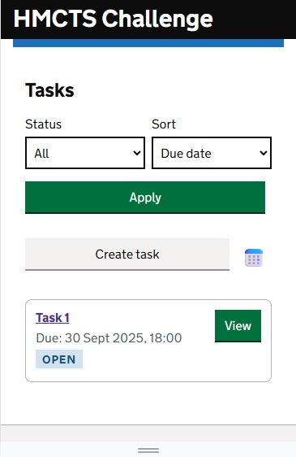
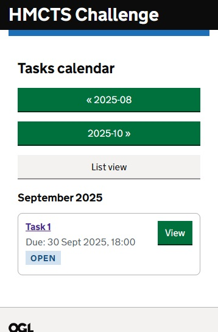
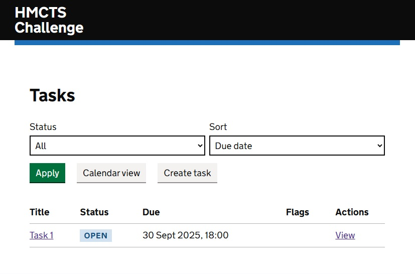
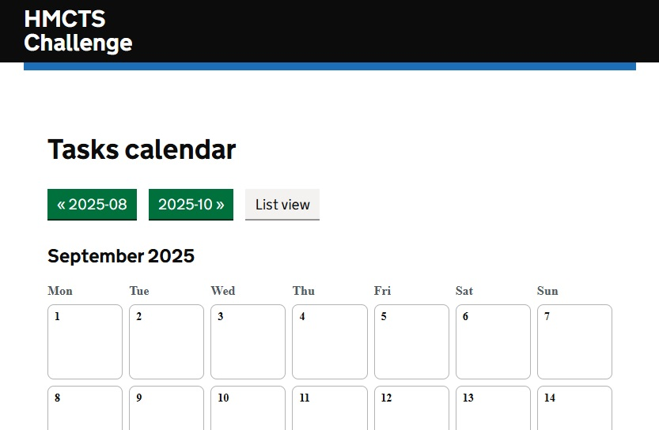
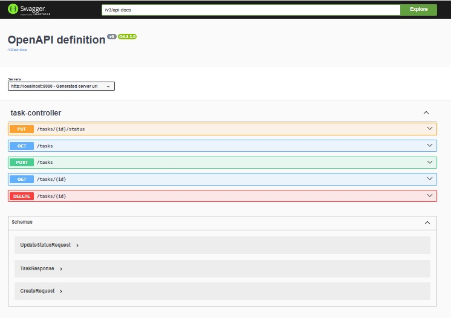
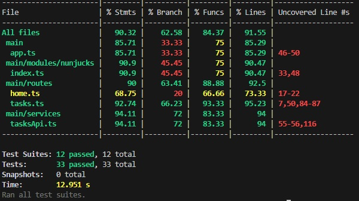
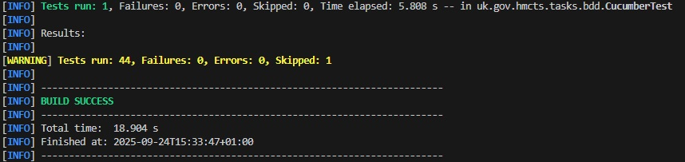

# HMCTS Task Challenge

This repository contains my submission for the [HMCTS Developer Challenge](https://github.com/hmcts/dts-developer-challenge).  
It demonstrates the design and implementation of a full-stack solution using **Java/Spring Boot** for the backend and **TypeScript/Node.js** for the frontend, following modern engineering practices around testing, CI/CD, containerisation, and accessibility.  See README for backend and frontend for more details:
- [API Service Readme](hmcts-api-service/README.md)
- [UI Frontend Readme](hmcts-ui-frontend/README.md)
---

## 📂 Project Structure

- **hmcts-api-service** – Spring Boot based API service  
  - REST endpoints defined by `openapi.yaml`  
  - Containerised with Docker and Helm charts  
  - CI/CD pipeline using Jenkins  
  - Unit and integration tests with JUnit  

- **hmcts-ui-frontend** – TypeScript/Node.js frontend  
  - Built with Webpack  
  - Styling and components based on GOV.UK Design System  
  - Tested with Jest, Playwright/CodeceptJS, and accessibility test suites  
  - Ready for server-side rendering (SSR)

---

## 📸 Screenshots

Users can navigate between Mobile and Tablet/Landscape UI by resizing the view or browser:

- **UI Pages**
- Mobile \
  \
  \

- Tablet \
  \
  \

- **API Swagger/OpenAPI Docs**  \
  \

- **Test Results**  
- UI Test Result \
  \
- API Test Result \
  \

---

## 🚀 Getting Started

### Prerequisites

- Java 21+  
- Node.js 20+  
- Yarn (Plug’n’Play enabled)  
- Docker & Docker Compose  
- Helm (for Kubernetes deployment)

### Running Locally

1. **Clone the repository**
   ```bash
   git clone https://github.com/your-username/hmcts-task-challenge.git
   cd hmcts-task-challenge
   ```

2. **Start the API service**
   ```bash
   cd hmcts-api-service/api
   ./mvnw spring-boot:run
   ```

3. **Start the frontend**
   ```bash
   cd ../hmcts-ui-frontend
   yarn install
   yarn start:dev
   ```

4. Open your browser at `http://localhost:3000`.

---

## 🧪 Testing

### Backend (API)
```bash
cd hmcts-api-service/api
./mvnw test
```

### Frontend (UI)
```bash
cd hmcts-ui-frontend
yarn test
```

The test suites include:
- Unit tests (Jest for UI, JUnit for API)  
- Accessibility tests (axe-core/Jest a11y)  
- End-to-end tests (CodeceptJS/Playwright)  
- Smoke and route tests for frontend behaviour  

---

## 🛠️ CI/CD Pipeline

- **Jenkinsfile** provided for automated build/test/deployment.  
- CI/CD can be extended with GitHub Actions for PR validation.  
- Containers built with Docker.  
- Deployment templates with Helm for Kubernetes orchestration.  

---

## 📐 Architecture Overview


---

## 🔑 Key Features

- Full-stack application with separation of concerns  
- REST API defined with OpenAPI  
- GOV.UK compliant frontend design  
- Strong test coverage (unit, integration, accessibility, e2e)  
- Containerised deployment with Docker & Helm  
- CI/CD ready with Jenkins pipeline  

---

## 📄 License

MIT License (see `LICENSE` file).

---

 
